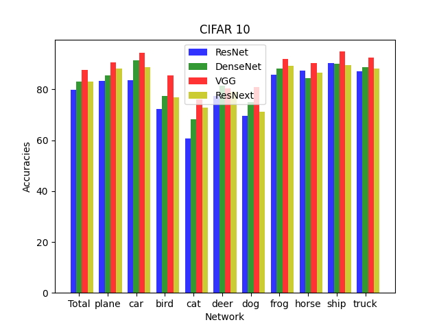
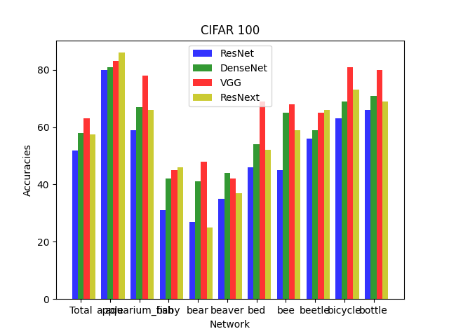

# DL-CIFAR10

Comparison of 4 different popular neural network architectures (ResNet, DenseNet, VGG, ResNext) on the CIFAR10 and CIFAR100 dataset.

### Required packages:
- numpy
- python (version 3.6)
- pytorch
- matplotlib

### Dataset and networks
CIFAR10 and CIFAR100 consist of 50,000 32x32 color training images and 10,000 test images. Images are divided in different classes - 10 classes in CIFAR10 and 100 in CIFAR100. With the parameter frozen, the pretrained parameters of the networks can be frozen. For this dataset it is not a good idea. Therefore, all the parameters in the tests are not frozen. To use the pretrained networks for this dataset, the output layer has to be changed to meet the desired output dimension (10 for CIFAR10 and 100 for CIFAR100).

### Results
The tests show that with the given settings VGG is outperforming the other networks for both datasets:

